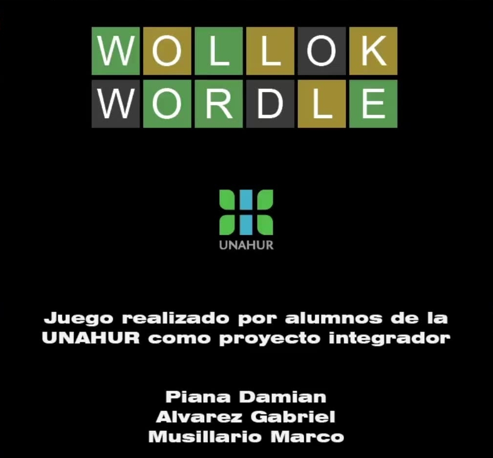
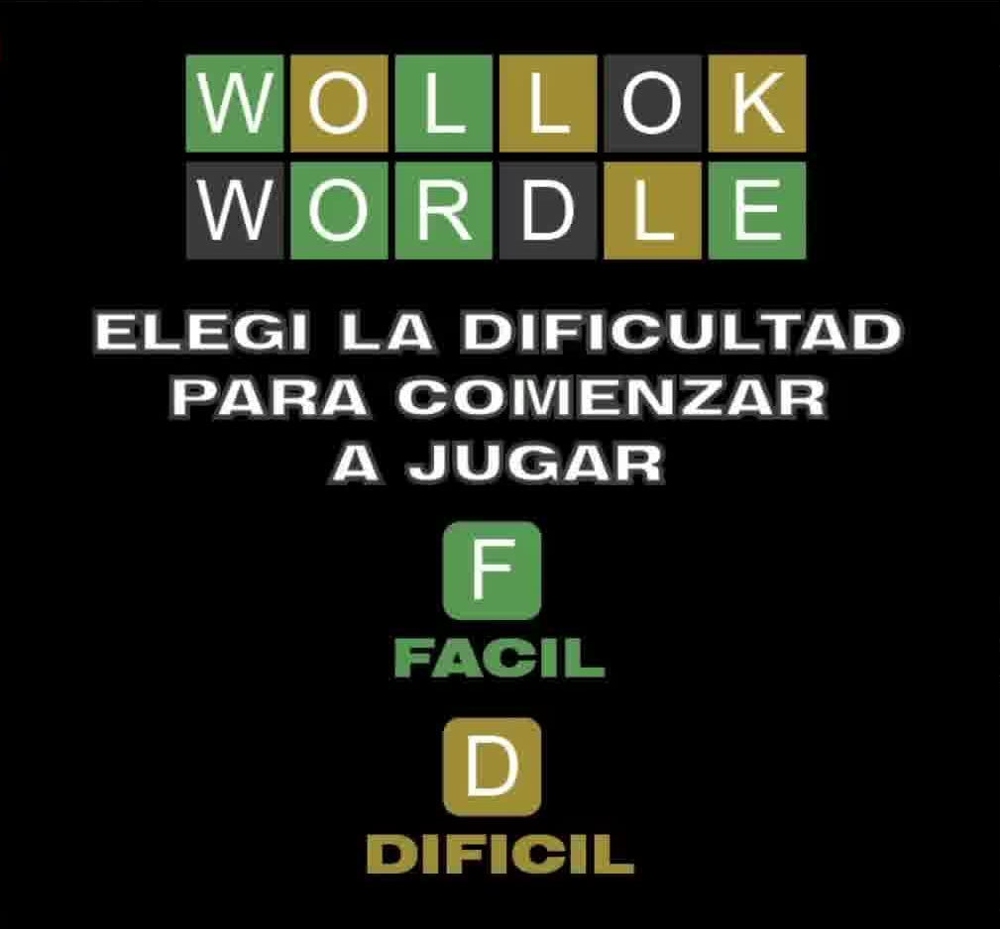
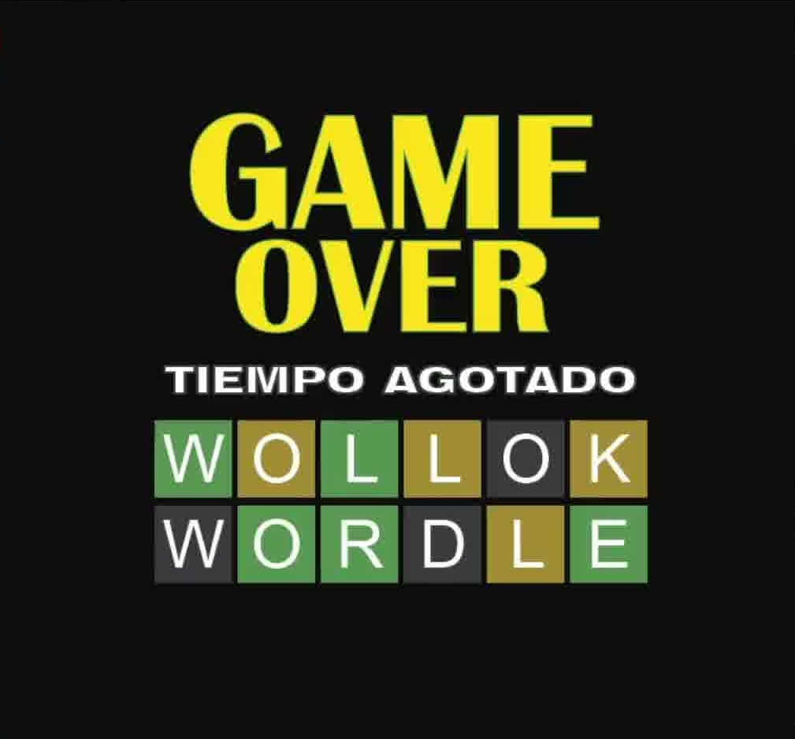
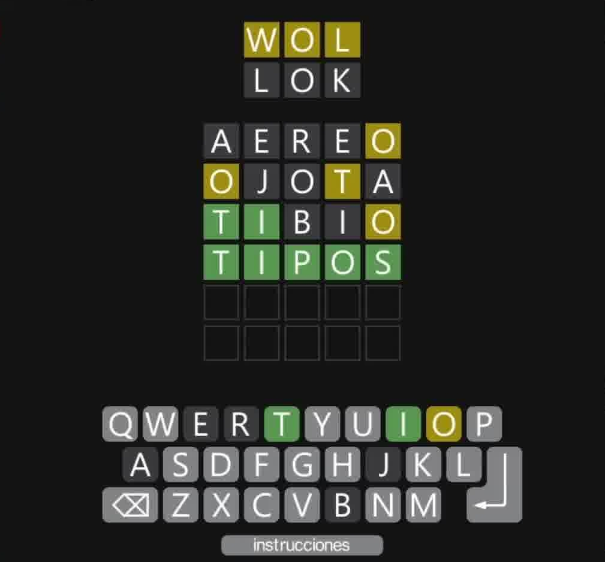
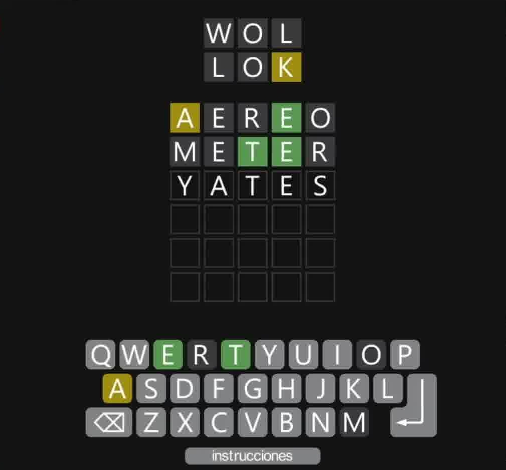
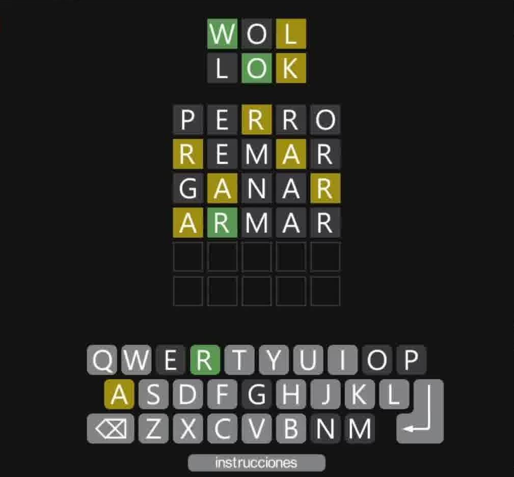
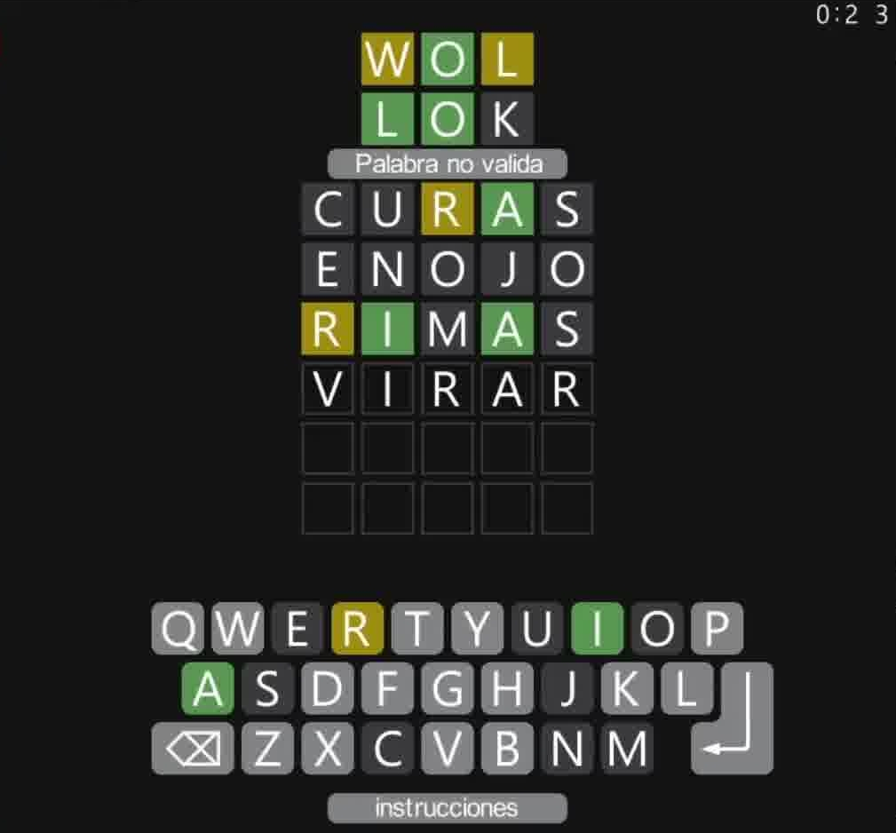
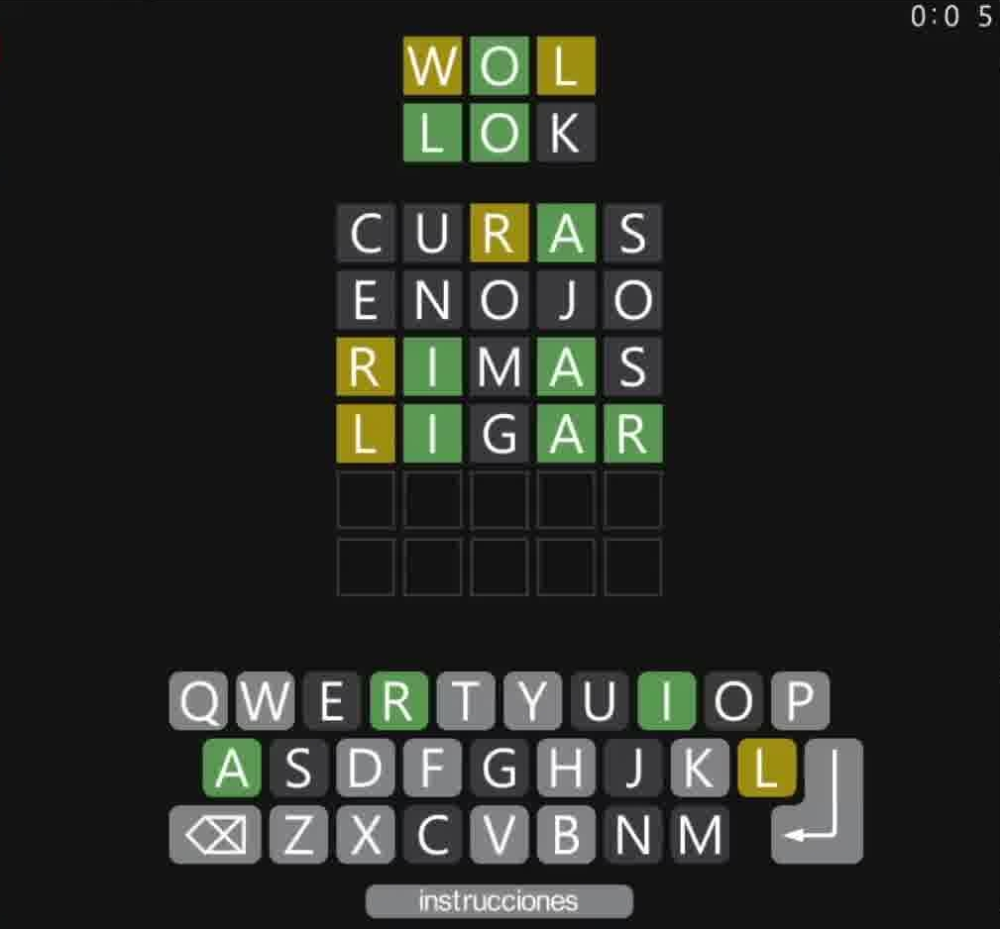

# Wordle Wollok Edition

## Equipo de desarrollo

- Damian Piana
- Gabriel Alvarez
- Marco Musillario

## Reglas de Juego / Instrucciones

- Al iniciar el juego, aparece por unos segundos una pantalla de presentacion, y despues aparece una pantalla donde se selecciona la dificultad: 
    - **Fácil**: Tenes 6 intentos para adivinar una palabra de 5 letras. Tiempo ilimitado
    - **Difícil**: Tenes los mismos intentos que en el modo **Fácil**, pero solo contas con 1 minuto para adivinar la palabra. 

- Luego de elegir la dificultad, empieza la partida. Tenés que adivinar una palabra de 5 letras, y contás con 6 intentos.

- Para empezar escribí una palabra y después apretar Enter para enviar tu intento.

- Cuando envies tu intento, se marcaran en verde las letras que esten en la posicion correcta, en amarillo las letras que esten en la palabra, pero en la posicion equivocada, y en gris oscuro las que no esten en la palabra.

- Una vez termines, sea porque adivinaste, te quedaste sin intentos, o se te acabó el tiempo, se mostrará por unos segundos una pantalla que indica si ganaste o perdiste, y después, aparece la pantalla de dificultad nuevamente, para que puedas jugar cuantas veces quieras.

## Capturas
**Pantalla de inicio**

**Selector de dificultad**

**Ganaste!!**

**Game Over**

**Misc.**

## Otros

- Programacion con Objetos 1 Comision 1 / Universidad Nacional de Hurlingam
- Wollok 3.0.0
- Una vez terminado, no tenemos problemas en que el repositorio sea público
